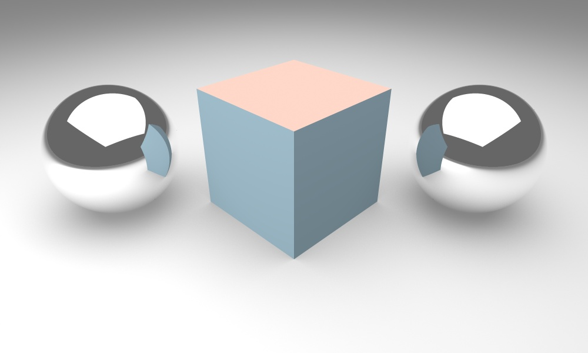
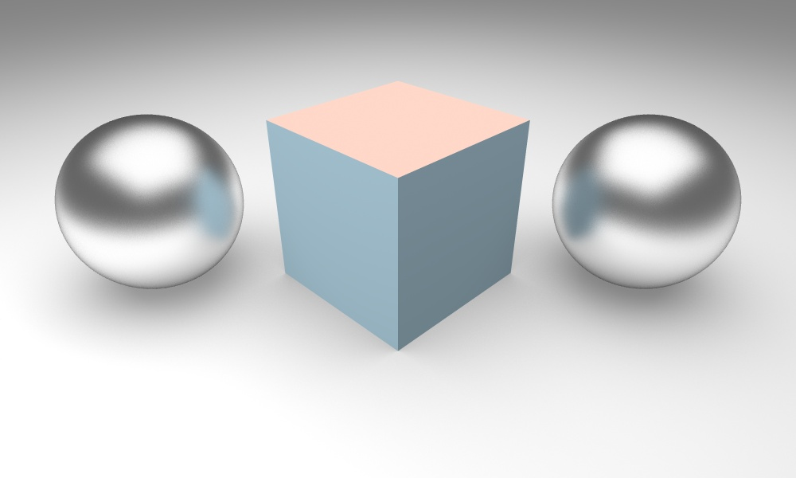

# OpenRT: Open Source Ray Tracing Library

OpenRT is a C++ ray-tracing library, which allows for synthesis of photo-realistic images. First of all, the library is developed for academic purposes: as an accompaniment to the computer graphics course and as a teaching aid for university students. Specifically, it includes the following features:
- **Distribution Ray Tracing**
- **Global Illumination**

OpenRT aims for a realistic simulation of [light transport](https://en.wikipedia.org/wiki/Computer_graphics_lighting), as compared to other rendering libraries, such as based on [rasterisation](https://en.wikipedia.org/wiki/Rasterisation), which focuses more on the realistic simulation of geometry. Effects such as reflections and shadows, which are difficult to simulate using other algorithms, are a natural result of the ray tracing algorithm. The computational independence of each ray makes our ray-tracing library amenable to a basic level of parallelisation.

OpenRT is released under a BSD license and hence it is free for both academic and commercial use. The code is written entirely in C++ with using the [OpenCV](www.opencv.org) library. 

Check out the [project site](www.openrt.org) for all the details like
- Online documentation
- Installation guide
- Tutorials

Please join the [OpenRT-user Q&A forum](http://project-10.de/forum/viewforum.php?f=33) to ask questions and talk about methods and models. Framework development discussions and thorough bug reports are collected on [Issues](https://github.com/Project-10/OpenRT/issues).

  

